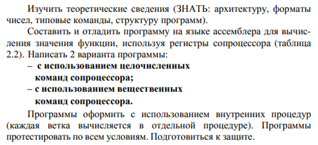
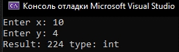
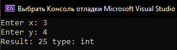
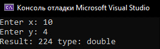
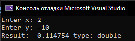
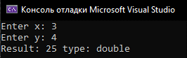

***<h1 align = "center">Решение уравнений</a>***

**<h2> задача: </h2>**  

  

  

**<h2>Результаты: </h2>**  

**<h3>целочисленные: </h3>**  

  

  

  

**<h3>вещественные: </h3>**

  

  

  